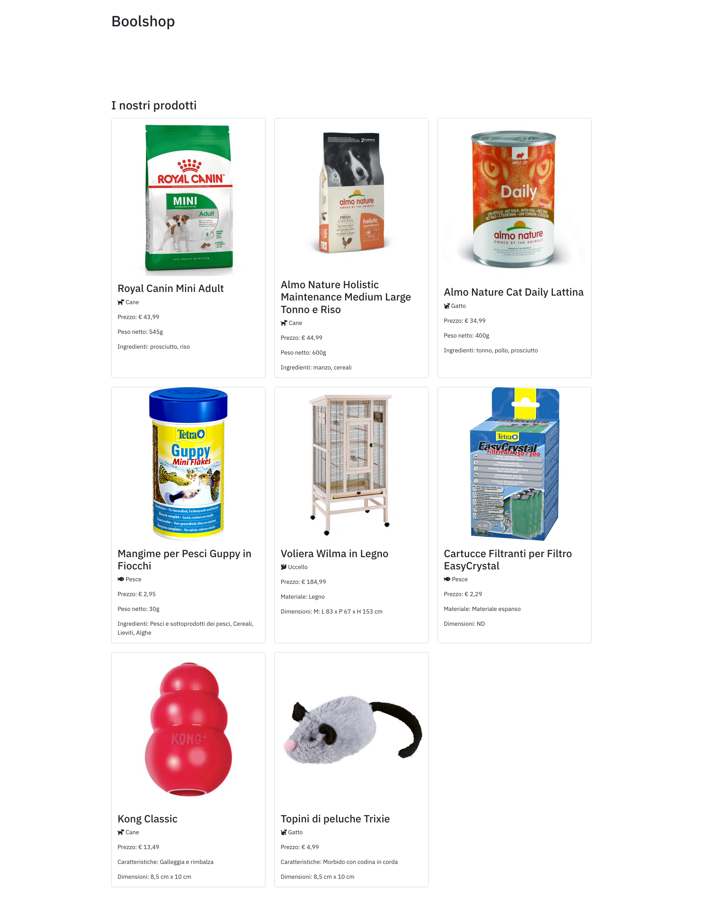

Pet Shop
===
## CONSEGNA

Immaginare quali sono le classi necessarie per creare uno shop online con le seguenti caratteristiche:
 - L’e-commerce vende **prodotti** per animali.
 - I prodotti sono categorizzati, le **categorie** sono Cani o Gatti.
 - I prodotti saranno oltre al **cibo**, anche **giochi**, **cucce**, etc.
 Stampiamo delle card contenenti i dettagli dei prodotti, come immagine, titolo, prezzo, icona della categoria ed il tipo di articolo che si sta visualizzando (prodotto, cibo, gioco, cuccia).

Se non dovesse essere chiarissima la consegna vi mando una descrizione un po’ più dettagliata:
  - L’e-commerce vende prodotti per gli animali.
  - I prodotti saranno oltre al cibo, anche giochi e accessori (cucce, guinzagli, lettiere, acquari, etc).
  - I prodotti possono appartenere a una tra queste categorie:
    - Cane, 
    - Gatto, 
    - Uccelli, 
    - Pesci
  - Una volta create le classi che descrivono il nostro sistema, instanziate prima tutte le categorie che ci serviranno, poi create alcuni prodotti di differenti categorie e stampateli nella pagina sotto forma di schede.
  
Vi lascio anche lo screenshot con un possibile risultato finale.

